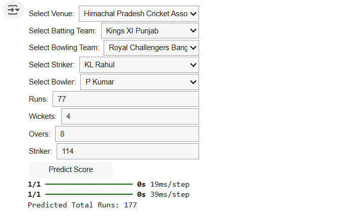
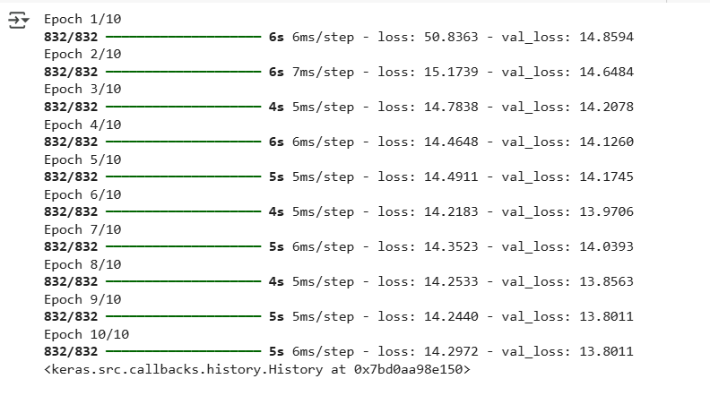

# 🏏 IPL Score Prediction using Deep Learning

Cricket is no longer just about instincts — it's about **data-driven decisions**. In high-stakes matches like the Indian Premier League (IPL), every run, every over, and every wicket can shift the momentum. This project uses deep learning to predict the final score of a batting team in a T20 match, based on real-time inputs like overs, runs, wickets, and team details.

---

## ❓ Why Use Deep Learning for Score Prediction?

While traditional ML models struggle with complex data, deep learning excels:

- 📈 **Pattern Recognition**: Learns from historical IPL datasets automatically  
- ⚡ **Multivariate Analysis**: Handles many inputs like teams, overs, venue, wickets  
- 🎯 **High Accuracy**: Outperforms simpler models by capturing non-linear relationships  
- 🧠 **Real-Time Use**: Ideal for broadcasters, analysts, apps, and fantasy platforms

---

## ✨ Project Highlights

- ✅ Deep Neural Network (DNN) built using **TensorFlow (Keras)**
- 🧼 Preprocessing: Label Encoding, Feature Scaling, Feature Selection
- 📊 Visualizations using **Matplotlib** and **Seaborn**
- 🧪 Evaluated with **Mean Absolute Error (MAE)**
- 🖱️ Interactive prediction using **ipywidgets**
- 📁 Historical data: IPL seasons **2008 to 2017**

---

## 📸 Screenshots

### 🎯 Prediction Output

> A live prediction of the final score based on match conditions:



### 📉 Model Training (Optional)

> MAE and loss over training epochs:



---

## 🔧 Project Pipeline

### 📦 Installing Libraries

Import required libraries such as:

- `numpy`, `pandas` – Data processing  
- `matplotlib`, `seaborn` – Visualizations  
- `scikit-learn` – Preprocessing & model tools  
- `tensorflow.keras` – Deep learning model  
- `ipywidgets` – Interactive input for predictions

### 📂 Loading the Dataset

- Load IPL dataset from 2008–2017  
- Contains batting/bowling teams, venue, players, overs, wickets, etc.  
- Load data with `pandas.read_csv()` into DataFrame

### 🔤 Encoding

- Apply **Label Encoding** to convert text into numbers  
- Store encoders in a dictionary for consistent transformation  
- Ensure all categorical columns are transformed correctly

### 🏋️‍♂️ Training

- Features selected and split using `train_test_split()`  
- Scale features using `MinMaxScaler`  
- Neural network architecture: `Sequential`, `Dense`, `ReLU`, `Linear`  
- Compiled with **Huber Loss** and **Adam optimizer**

### 📈 Evaluation

- Evaluate model on test set using **Mean Absolute Error (MAE)**  
- Predict and compare actual vs predicted scores

### 🖱️ Interactive Widget

- Built using `ipywidgets.Dropdown`, `Button`, `display()`  
- Users select real-time match conditions to predict final score  
- Widget automatically encodes inputs, applies scaler, and predicts

---

## ⚙️ How to Run This Project on Google Colab

Follow these simple steps to run the IPL Score Prediction project in Google Colab:

1. 📥 **Download the Project**

   - Click the green **`Code`** button at the top of this repository.
   - Select **`Download ZIP`** and extract it to your local system.

2. 🔐 **Login or Create a Google Colab Account**

   - Go to [Google Colab](https://colab.research.google.com/)
   - Sign in with your Google account or create one if needed.

3. 📂 **Upload and Open the `.ipynb` File**

   - Click **`File > Upload Notebook`** and select the `ipl_score_prediction.ipynb` file from the downloaded folder.

4. 📄 **Import the Dataset**

   - Make sure the dataset CSV file (e.g., `ipl.csv`) is uploaded in the same runtime using:
     ```python
     from google.colab import files
     files.upload()
     ```

5. ▶️ **Run the Code**

   - Run each cell one by one.
   - The notebook will preprocess data, train the model, and show the prediction output.

---

✅ That’s it! You can now test score predictions interactively right in your browser.


## 🚀 How to Run This Project

To run this project locally:

### 1️⃣ Clone the Repository

```bash
git clone https://github.com/Rohitlakha/ipl-score-prediction.git
cd ipl-score-prediction
```

### 2️⃣ Install Required Libraries

```bash
pip install -r requirements.txt
```
If not available:

```bash
pip install numpy pandas matplotlib seaborn scikit-learn tensorflow ipywidgets

```

### 3️⃣ Run the Notebook

```bash
jupyter notebook IPL_Score_Prediction_using_DL.ipynb

```
Or run the script:

```bash
jupyter notebook IPL_Score_Prediction_using_DL.ipynb

```

### 4️⃣ Use the Interactive Widget
Scroll to the bottom of the notebook. Use the dropdowns to input match conditions and get live score predictions!

## 🌐 Real-World Applications

- 🏏 **Team Strategy**: Make informed in-game decisions using predictive analytics  
- 📺 **Broadcasting**: Enhance live commentary with predicted scores and insights  
- 📊 **Fantasy Leagues**: Support fantasy player picks and match predictions  
- 📱 **Apps**: Integrate the prediction engine in mobile or web cricket analytics platforms  

---

## 🌱 Future Improvements

- 🔍 Use **LSTM** or other time-series models for sequential data prediction  
- 📈 Include additional data such as **player stats**, **match history**, and **weather conditions**  
- 🧪 Perform thorough **hyperparameter tuning** and **model optimization**  
- 🌐 Deploy as a **web app or API** using **Streamlit**, **Flask**, or **FastAPI**  

---

## 🙋 Author

**Rohit Lakha**  
🔗 [LinkedIn](https://www.linkedin.com/in/rohit-lakha/) • 🔗 [GitHub](https://github.com/Rohitlakha)

---

⭐ *Star this repo if you find it helpful or interesting!*


